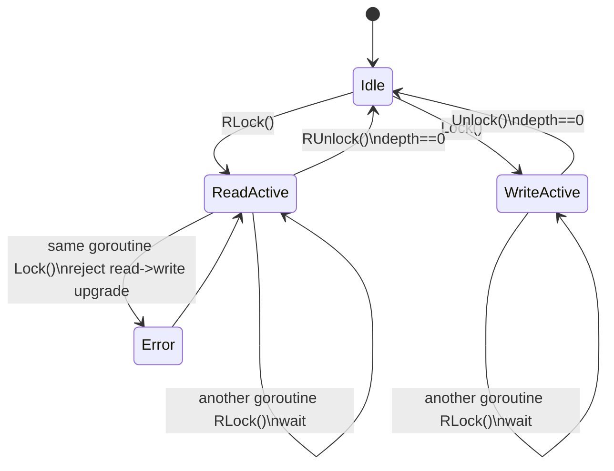

# go modbus
## NOTE: Archived, not maintain.
## NOTE: 已归档, 不再维护, 放弃License. 有需要的可以自由分发
modbus write in pure go, support rtu,ascii,tcp master library,also support tcp slave.

[](https://godoc.org/github.com/w6xian/go-modbus)
[](https://pkg.go.dev/github.com/w6xian/go-modbus/v2?tab=doc)
[](https://codecov.io/gh/w6xian/go-modbus)

[](https://goreportcard.com/report/github.com/w6xian/go-modbus)
[](https://raw.githubusercontent.com/w6xian/go-modbus/master/LICENSE)
[](https://github.com/w6xian/go-modbus/tags)
[](https://sourcegraph.com/github.com/w6xian/go-modbus?badge)


### Supported formats

- modbus Serial(RTU,ASCII) Client
- modbus TCP Client
- modbus TCP Server

### Features

- object pool design,reduce memory allocation
- fast encode and decode
- interface design
- simple API and support raw data api

### Installation

Use go get.
```bash
    go get github.com/w6xian/go-modbus
```

Then import the package into your own code.
```bash
    import modbus "github.com/w6xian/go-modbus"
```

### Supported functions

---

bit access:
*   Read Discrete Inputs
*   Read Coils
*   Write Single Coil
*   Write Multiple Coils

16-bit access:
*   Read Input Registers
*   Read Holding Registers
*   Write Single Register
*   Write Multiple Registers
*   Read/Write Multiple Registers
*   Mask Write Register
*   Read FIFO Queue

### clientLock design

`client` uses a custom `clientLock` instead of `sync.RWMutex`.
Its goal is not to allow concurrent readers. Its goal is to serialize access to the shared Modbus bus/connection while still keeping a clear distinction between read operations (`RLock`) and write operations (`Lock`).

Key points:

- `RLock` means "enter read operation mode", not "shared reader mode"
- `Lock` means "enter write operation mode"
- only one goroutine can hold the bus at a time
- pending writers block new readers to avoid writer starvation
- nested locking is allowed for the same goroutine
- upgrading from `RLock` to `Lock` is rejected

State flow:



Behavior notes:

1. `Idle`
   No goroutine owns the client lock.

2. `ReadActive`
   A read operation is in progress. Other goroutines must wait. If a writer is already waiting, new readers must also wait.

3. `WriteActive`
   A write operation is in progress. All other goroutines must wait.

4. Reentrant behavior
   The owning goroutine may enter the lock again. This is tracked with `depth`.

5. No read-to-write upgrade
   If the same goroutine already holds `RLock`, calling `Lock` returns `modbus: cannot upgrade read lock to write lock`.

In short, `clientLock` is closer to a reentrant single-owner bus lock with read/write intent markers than to a standard concurrent reader-writer lock.

### Example

---

modbus RTU/ASCII client see [example](_examples/client_rtu_ascii)

[embedmd]:# (_examples/client_rtu_ascii/main.go go)
```go
package main

import (
	"fmt"
	"time"

	"github.com/goburrow/serial"

	modbus "github.com/w6xian/go-modbus"
)

func main() {
	p := modbus.NewRTUClientProvider(modbus.WithEnableLogger(),
		modbus.WithSerialConfig(serial.Config{
			Address:  "/dev/ttyUSB0",
			BaudRate: 115200,
			DataBits: 8,
			StopBits: 1,
			Parity:   "N",
			Timeout:  modbus.SerialDefaultTimeout,
		}))

	client := modbus.NewClient(p)
	err := client.Connect()
	if err != nil {
		fmt.Println("connect failed, ", err)
		return
	}
	defer client.Close()

	fmt.Println("starting")
	for {
		_, err := client.ReadCoils(3, 0, 10)
		if err != nil {
			fmt.Println(err.Error())
		}

		//	fmt.Printf("ReadDiscreteInputs %#v\r\n", results)

		time.Sleep(time.Second * 2)
	}
}
```


modbus TCP client see [example](_examples/client_tcp)

[embedmd]:# (_examples/client_tcp/main.go go)
```go
package main

import (
	"fmt"
	"time"

	modbus "github.com/w6xian/go-modbus"
)

func main() {
	p := modbus.NewTCPClientProvider("192.168.199.188:502", modbus.WithEnableLogger())
	client := modbus.NewClient(p)
	err := client.Connect()
	if err != nil {
		fmt.Println("connect failed, ", err)
		return
	}
	defer client.Close()

	fmt.Println("starting")
	for {
		_, err := client.ReadCoils(1, 0, 10)
		if err != nil {
			fmt.Println(err.Error())
		}

		//	fmt.Printf("ReadDiscreteInputs %#v\r\n", results)

		time.Sleep(time.Second * 2)
	}
}
```

modbus TCP server see [example](_examples/server_tcp)

[embedmd]:# (_examples/server_tcp/main.go go)
```go
package main

import (
	modbus "github.com/w6xian/go-modbus"
)

func main() {
	srv := modbus.NewTCPServer()
	srv.LogMode(true)
	srv.AddNodes(
		modbus.NewNodeRegister(
			1,
			0, 10, 0, 10,
			0, 10, 0, 10),
		modbus.NewNodeRegister(
			2,
			0, 10, 0, 10,
			0, 10, 0, 10),
		modbus.NewNodeRegister(
			3,
			0, 10, 0, 10,
			0, 10, 0, 10))

	err := srv.ListenAndServe(":502")
	if err != nil {
		panic(err)
	}
}
```

### References

---

- [Modbus Specifications and Implementation Guides](http://www.modbus.org/specs.php)
- [goburrow](https://github.com/goburrow/modbus)

### JetBrains OS licenses
go-modbus had been being developed with GoLand under the free JetBrains Open Source license(s) granted by JetBrains s.r.o., hence I would like to express my thanks here.

<a href="https://www.jetbrains.com/?from=w6xian/go-modbus" target="_blank"></a>

### Donation

if package help you a lot,you can support us by:

**Alipay**


**WeChat Pay**


